<!-- PROJECT LOGO -->

<h1 align="center">

# TRANSDUCER - ISRact stroma Analysis

</h1>

<h2 align="left">

## Summary

</h2>
Along this Document a quick summary is provided with references to the figures. In each of the parts of this summary a list of the scripts that produce the named figures. Afterwards, if any modification has happened, or tried, it will be specified here. Later on, the figures are also provided for visualization

<!-- TABLE OF CONTENTS -->

Table of Contents

<ol>

<li><a href="#initial-exploration">Initial Exploration</a>

<li><a href="#transcriptome-ica">Transcriptome ICA</a></li>

<li><a href="#translatome-ica">Translatome ICA</a></li>

<li><a href="#caf-involvement">CAF Involvement</a></li>

</ol>

<!-- Content -->

<h2 align="left">

## Initial Exploration

</h2>

This Section of the repository covers the analysis performed on the PDX stroma to explore the context supporting ISRact tumour cells taking the advantage of the separation of tumour and stroma fractions of reads coming from Patient derived xenograft (PDX) models.

To this aim, the stroma was analysed with supervised dimensionality reduction tools, where based in prior knowledge, gene transcription is codified into cell type proportions or transcription factor activities. For cell type proportions mMCPcounter and ImmuCC signatures were utilized. For estimating transcription factor activities we made use of the Dorothea PAN Cancer and GTEx regulons through Viper. Gtex used for stromal TF activity calculation, and PanCancer for the tumour TF activity (**FigR1**).

Then, we proceed with the exploration of the stroma using Independent Component Analysis (ICA), first in the transcriptome and latter in the translatome.

Code:

 * Preprocessing and normalisation -> [02_PDX_stroma/00_Data](https://github.com/VeraPancaldiLab/TRANSDUCER/tree/main/02_PDX_stroma/00_Data)
 * [02_PDX_stroma/03_Analysis/180122_Various](https://github.com/VeraPancaldiLab/TRANSDUCER/tree/main/02_PDX_stroma/03_Analysis/180122_Various)

<h2 align="left">

## Transcriptome ICA

</h2>

Once ICA was performed using 6 components, their validity was assessed by comparison with technical data, and other variables of interest, as the molecular classification of the tumour (measured by [PAMG](https://github.com/RemyNicolle/pdacmolgrad)) or the ICA classification that defined ISRact derived from Shin et al 2024 (**FigR2**). After detecting IC.4_cyt as one of the components most associated with ISRact, correlation with cell type proportions and TF activities revealed a relation with Immunity and Lymphocite recruitment (**FigR3**). Then a tailored analysis on the gene contributions of IC.4_cyt by GSVA and a exploration in the context of Protein protein interaction networks confirmed the relation of IC.4_cyt and thus ISRact with Interferon gamma signalling and antigen presentation (**FigR4**).

Code:

 * [02_PDX_stroma/03_Analysis/100122_ICABoot/ICA_cyt.R](https://github.com/VeraPancaldiLab/TRANSDUCER/blob/main/02_PDX_stroma/03_Analysis/100122_ICABoot/ICA_cyt.R)

<h2 align="left">

## Translatome ICA

</h2>

Before analysing the translatome of PDX stroma, translation efficacy had to be calculated. For that the same approach as Shin et al 2024 was used (**FigR5**).

Then, as before ICA was performed using 6 components, their validity was assessed by comparison with technical data, and other variables of interest, [PAMG](https://github.com/RemyNicolle/pdacmolgrad) or the Shin et al. 2024 ICA classification that defined ISRact. After detecting IC.6_TEs as the components most associated with ISRAct, this not showed relation with cell type proprtions or TF activities (**FigR6**). 

Aiming to explore associations more relevant to the control of translatiom, correlation between sample scores and transcription of RNA Binding Proteins (RBPs) showed a specific correlation of IC.6_TEs with this group of proteins, and specifically with m6A methilationa and RNA degradation positively, and splicing and mRNA processing negatively (**FigR7**). While exploring the gene contributions in a similar way as in the transcriptional analysis, interestingly showed APP as translationally repressed, as well as DNA damage and methylation (**FigR8**). To explore the mechanisms behind this inherent translational regulation in depth we carried out an analysis of differential translated genes over the most contributing genes using Anota2seqUtils (**FigR9**). First looking at enrichment of known alterations revealed some signals of ISR activation (**FigR10**). Then an analysis of association of transcript features was done separately by regulatory region (5'UTR, CDS, 3'UTR). The assessment of DRACH motif abundance was not enough to determine the m6A presence as demonstrated by similar distributions of the mirror motif HCARD, showing a difference in length (**FigR11**). Analysis of relevant features for each region, including individual nucleotide composition and the abundance of every motifs of length > 5nt of the ATtRACT db for mice point out to an alteration in codon composition related to the optimality. In this context longer and less stable transcripts are upregulated in IC.6_TEs high, and thus ISRact high stroma. Glutamate related codons (GAA/GAG) showed to be more abundant too (**FigR12**). This could be potentially explained by lack of resources in the TME provoked by the tumour's metabolic deficiency. 

Exploring the relation between the most contributing genes utilizing again a PPI, this time segregating positive and negative contributing genes and considering their first neighbors revealed alterations in components from translation machinery biogenesis, to production of metabolism related components or cellular structure, potentially impacting immunity negatively. Lumican or LUM highlights as being highly downregulated, and the core of a Extra cellular matrix module, related to cancer associated fibroblasts (CAFs) (**FigR13**). Importantly LUM was shown to be important for many processes relevant for PDAC and cancer biology as migration or inflammation (See Discussion Thesis manuscript)

In this section the possibility of using a experimentaly defined RBP-target network generated from POSTAR3, and compare it with the ICA analysis to see whether some RBP was interacting with more IC.6_TEs highly contributing genes than expected randomly. We did this by Fisher exact test (**ABSENT IN MANUSCRIPT**). We are also planning on testing this by empirical randomisation.

Code:

* [02_PDX_stroma/03_Analysis/100122_ICABoot/ICA_TEs.R](https://github.com/VeraPancaldiLab/TRANSDUCER/blob/main/02_PDX_stroma/03_Analysis/100122_ICABoot/ICA_TEs.R)

* [02_PDX_stroma/03_Analysis/100122_ICABoot/IC_analysis.R](https://github.com/VeraPancaldiLab/TRANSDUCER/blob/main/02_PDX_stroma/03_Analysis/100122_ICABoot/IC_analysis.R)

* [02_PDX_stroma/03_Analysis/140923_ICA.TEs_Anota2seqUtils](https://github.com/VeraPancaldiLab/TRANSDUCER/tree/main/02_PDX_stroma/03_Analysis/140923_ICA.TEs_Anota2seqUtils)

<h3 align="left">

## CAF Involvement

</h3>

As some CAFs seemed to support the growth of ISRact cells in vitro in Shin et al. 2024, we explored their involvement in the stroma of PDX. For that we first explroed the gene expression of marker genes of defined CAF subtypes in relation with ISRact, IC.4_cyt and PAMG scores without success. We also explored the distribution of IC.4_cyt gene contibutions of the different markers genes highlighting the difficulty of questioning the TME composition in a bulk setting, specially using single cell markers (**FigR15**).

To interrogate CAFs at the level of translation, after an initial exploration suggesting exploring translation could be of interest (**FigR16**), we designed an experiment to produce signatures of CAFs under specific stimuli of importance in the PDAC stroma. Sadly, the analysis revealed technical problems possibly associated to the experimental complexity (**FigR17**). As part of this effort, and given the involvement with immunity I performed a profiling on MHCI and MHCII of 4 CAF cell lines under IFNG stimuli using [HLAHD](https://w3.genome.med.kyoto-u.ac.jp/HLA-HD/) (**ABSENT IN MANUSCRIPT**). 

In this topic, for the ease of usage of CAF sequencing data, and the exploration of CAF subtypes signatures among many other things I created a tool named  [CAFCOMPARER](https://github.com/j-solor/CAFCOMPARER) with the help of Margaux Dore (**ABSENT IN MANUSCRIPT**). 

With the increase in relevance, and abundance of different CAF subtypes, an in depth comparison using the team CAF library and scRNAseq data was carried out by Margaux Dore [m-dore](https://github.com/m-dore) under my supervision for her master thesis. This work will be continued in her PhD, starting on October 2024.

Code:

* [04_Deconvolution_TE/03_Sigantures/cell_types/fibroblast/PJ2003085/090921_FastqProcessing/GSEA.R](https://github.com/VeraPancaldiLab/TRANSDUCER/blob/main/04_Deconvolution_TE/03_Sigantures/cell_types/fibroblast/PJ2003085/090921_FastqProcessing/GSEA.R)

* [07_stimulated_CAFs/00_Data/Fetch%26Preporcessing.R](https://github.com/VeraPancaldiLab/TRANSDUCER/blob/main/07_stimulated_CAFs/00_Data/Fetch%26Preporcessing.R)

* [07_stimulated_CAFs/02_17AC_NTvsCondition/anota2seq_17AC_NTvsCond.R](https://github.com/VeraPancaldiLab/TRANSDUCER/blob/main/07_stimulated_CAFs/02_17AC_NTvsCondition/anota2seq_17AC_NTvsCond.R)

* HLA-HD -> [07_stimulated_CAFs/270824_HLAHD](https://github.com/VeraPancaldiLab/TRANSDUCER/blob/main/07_stimulated_CAFs/270824_HLAHD/)

################################################################################

<h2 align="left">

FIGURES

</h2>

<h3 align="left">

Transcription

</h3>

<h4 align="left">

**FigR1:** IL18-IFNG related signals are associated with ISRact stroma, with potential implications in
immune infiltration (pg 80)

</h4>

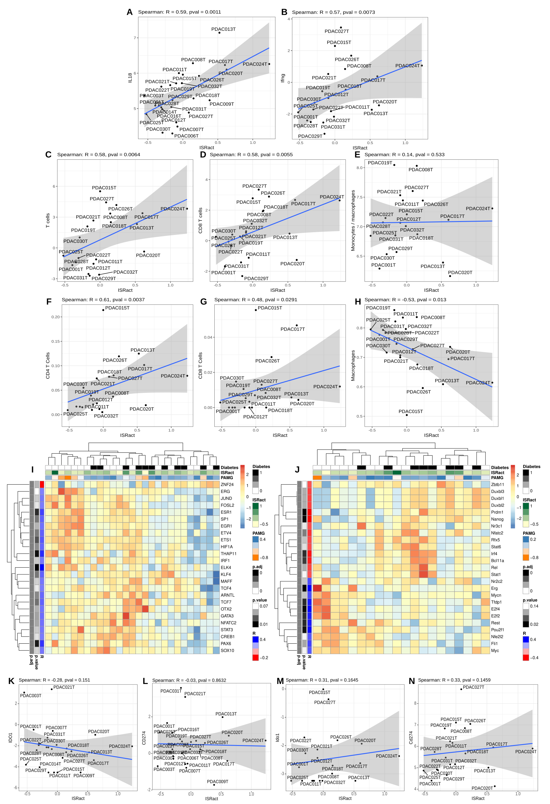

<h4 align="left">

**FigR2:** IC.4_cyt in PDX stroma is the transcriptional component most relevant to ISRAct tumour
phenotype (pg 87)

</h4>

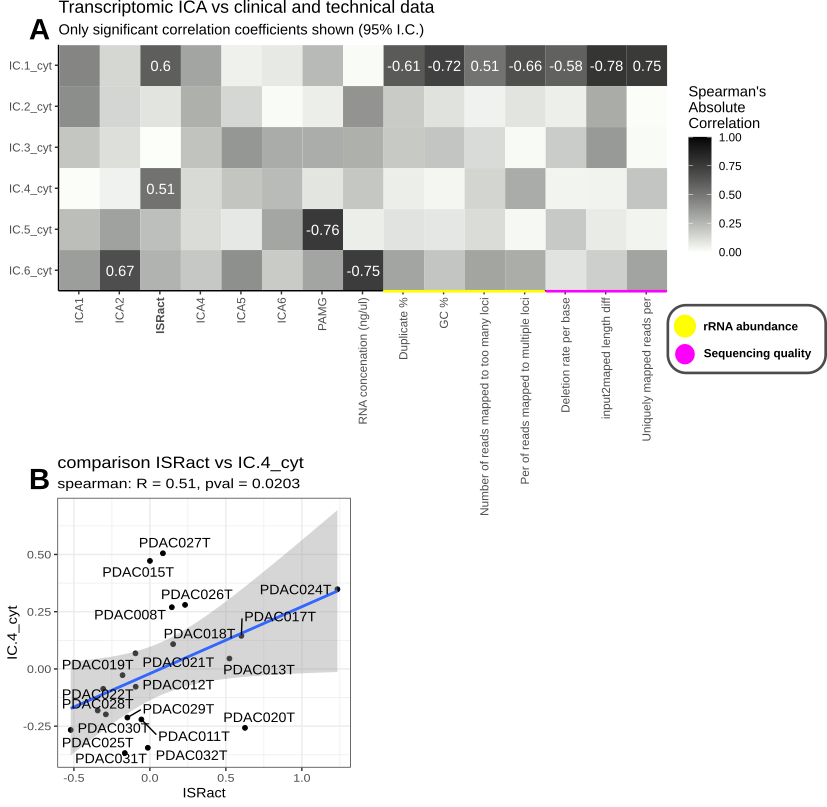

<h4 align="left">

**FigR3:** IC.4_cyt captures the relations with immunity observed in the preliminary analysis based on
correlations with Immune cell type proportions and TF activities (pg 89)

</h4>

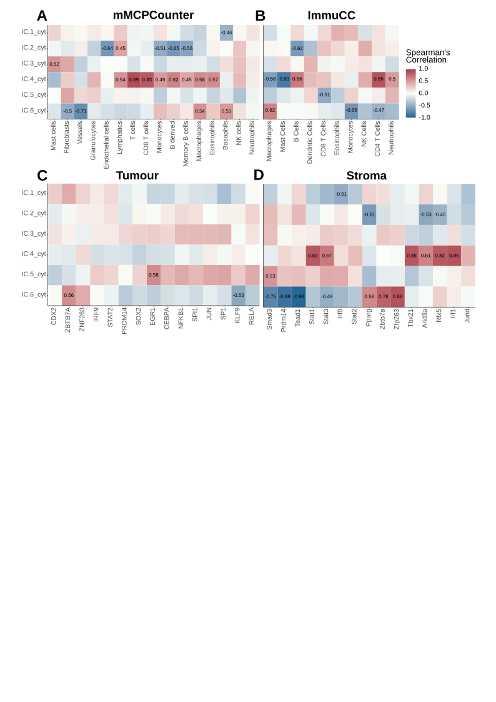

<h4 align="left">

**FigR4:** Analysis of IC.4cyt gene contributions confirms the relation of ISRact with immunity (pg 93)

</h4>

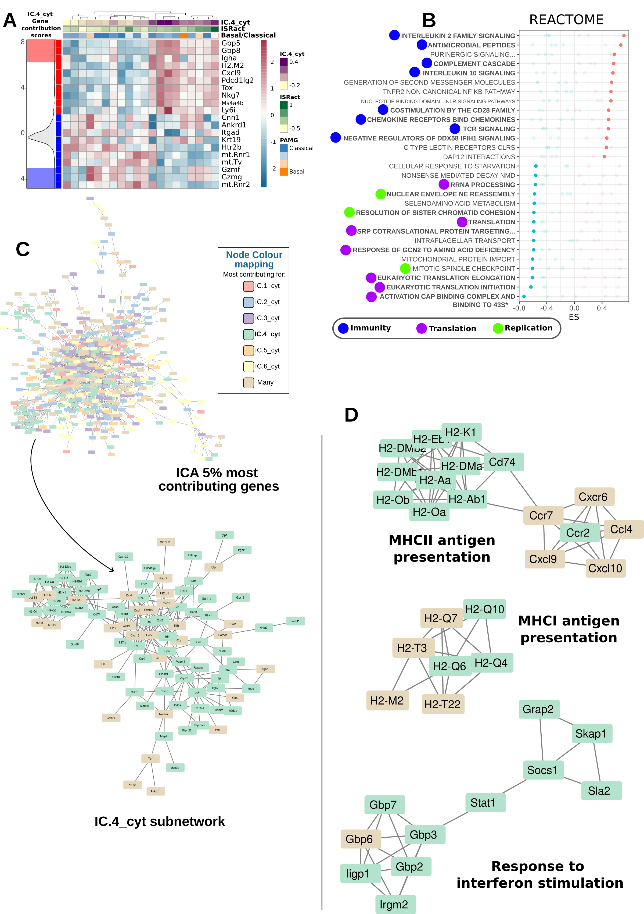

################################################################################
<h3 align="left">

Translation

</h3>

<h4 align="left">

**FigR5:** Translation efficacy calculation and the exclusion of PDAC001 (pg 95)

</h4>

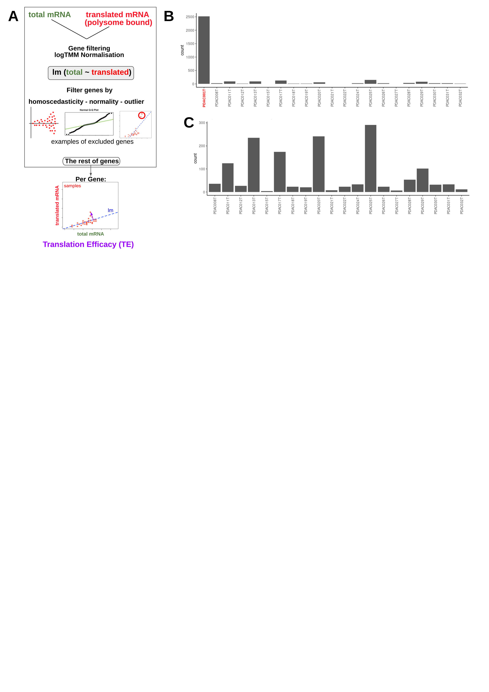

<h4 align="left">

**FigR6:** IC.6_TEs as the stromal translational component representing ISRact lacks relation with TF activities or Deconvolved cell type proportions (pg 99)

</h4>

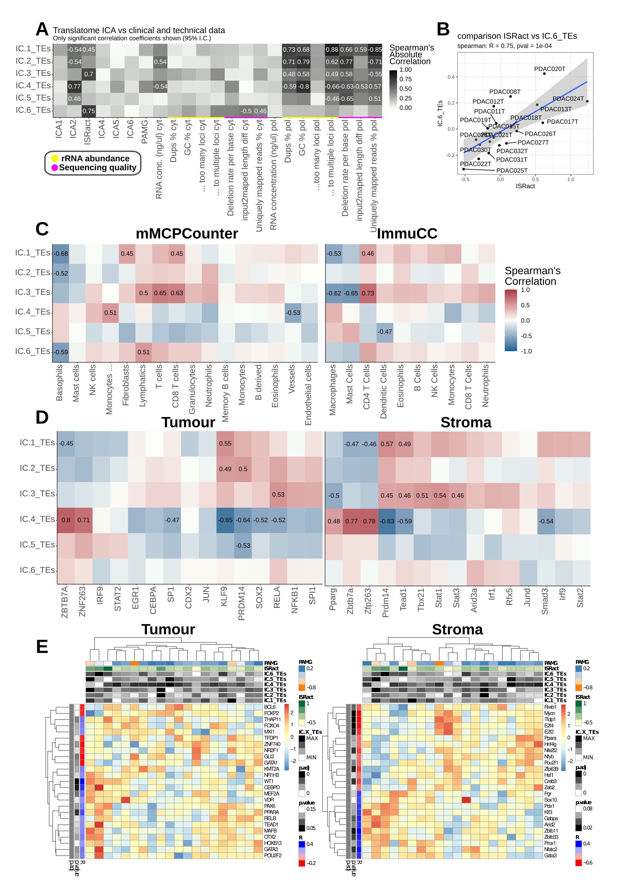

<h4 align="left">

**FigR7:** mRNA levels of RBPs are specifically associated with IC.6_TEs suggesting an involvement of m6A methylation, mRNA degradation and splicing in ISRact stroma (pg 101)

</h4>

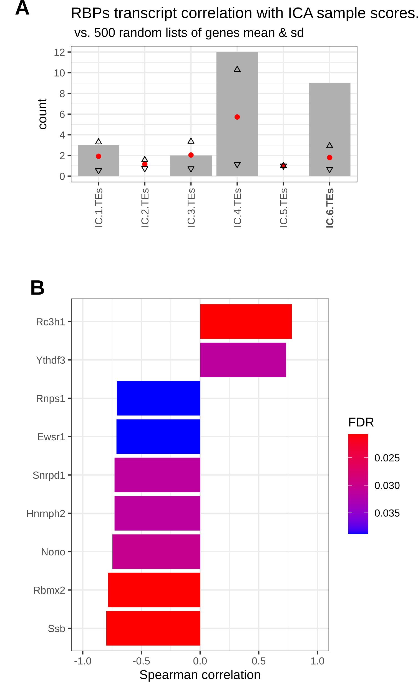

<h4 align="left">

**FigR8:** Gene contribution analysis reveals a diverse array of signals being captured by IC.6_TEs, among which is App (pg 103)

</h4>

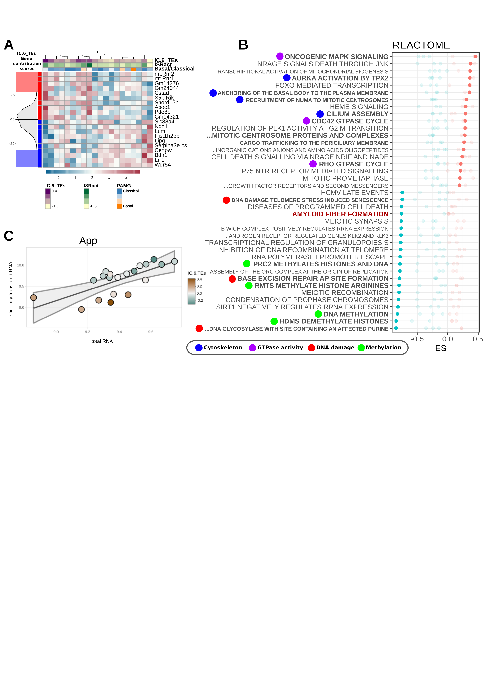

<h4 align="left">

**FigR9:** The genes selected as Up translated and Downtranslated from IC.6_TEs show enrichment for a wide range of functions (pg 105)

</h4>

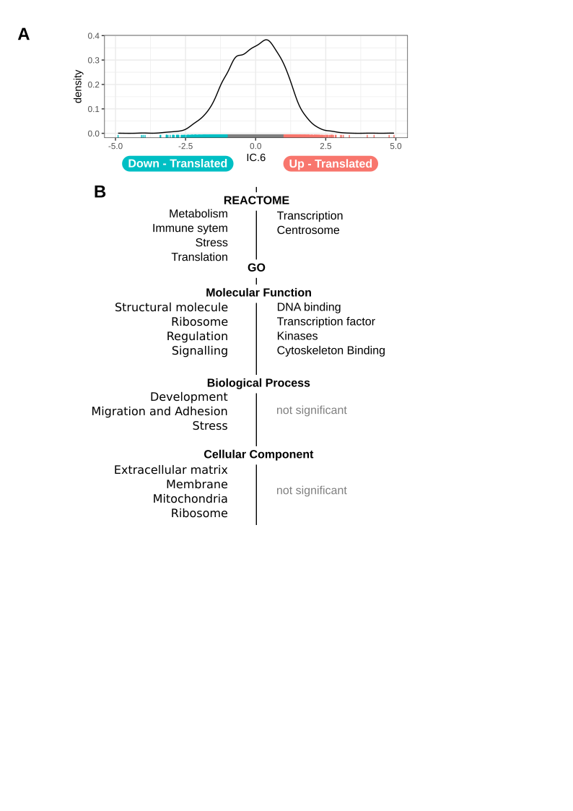

<h4 align="left">

**FigR10:** Anota2seqUtils analysis of Translation related signatures suggest some cells of the stroma could also be undergoing an ISR activation (pg 107)

</h4>

<h4 align="left">

**FigR11:** Isolated Anota2seqUtils analysis of the different gene regions shows a relation with length and a spurious association with DRACH motif presence (pg 108)

</h4>

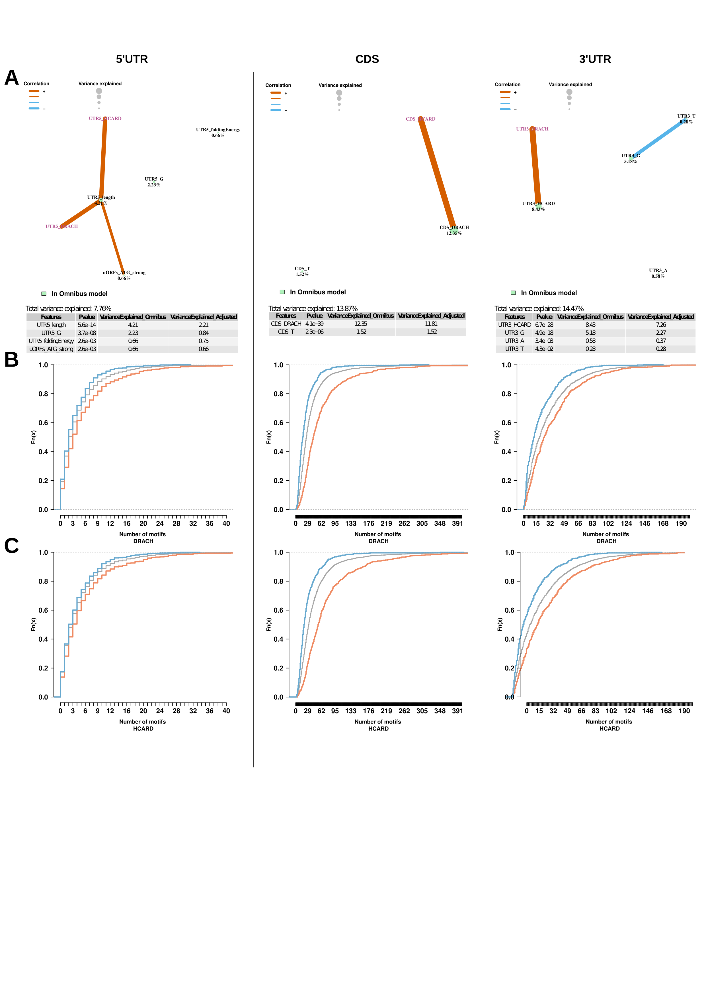

<h4 align="left">

**FigR12:** Isolated Anota2seqUtils analysis of the different gene regions ATtRACT motifs still shows lack of specificity and points to an involvement of mRNA degradation/optimal codon usage (pg 110)

</h4>

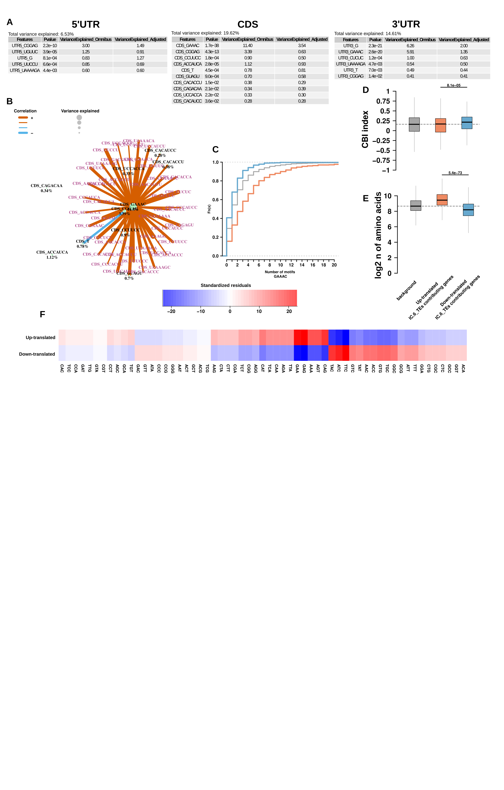

<h4 align="left">

**FigR13:** Integrated analysis of IC.6_TEs highly contributing genes shows sparsity, but gives clues to an array of different functions, highlighting a potential role of matrix disorganisation, and immunosuppressive signals through downregulation of Lum and Ccl11 respectively (pg 112)

</h4>

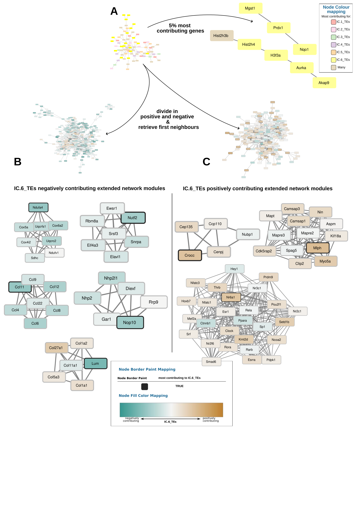

################################################################################
<h3 align="left">

Comparsion Transcription VS Translation 

</h2>

<h3 align="left">

**FigR14:** Correlation analysis between tumour translation components, and stromal Transcription and translation ones highlight the need for a bigger cohort (pg 114)

</h4>

################################################################################
<h3 align="left">

CAF involvement

</h3>

<h4 align="left">

**FigR15**: Literature defined CAF subtypes do not seem associated with ISRact nor IC.4_cyt (pg 116)

</h4>

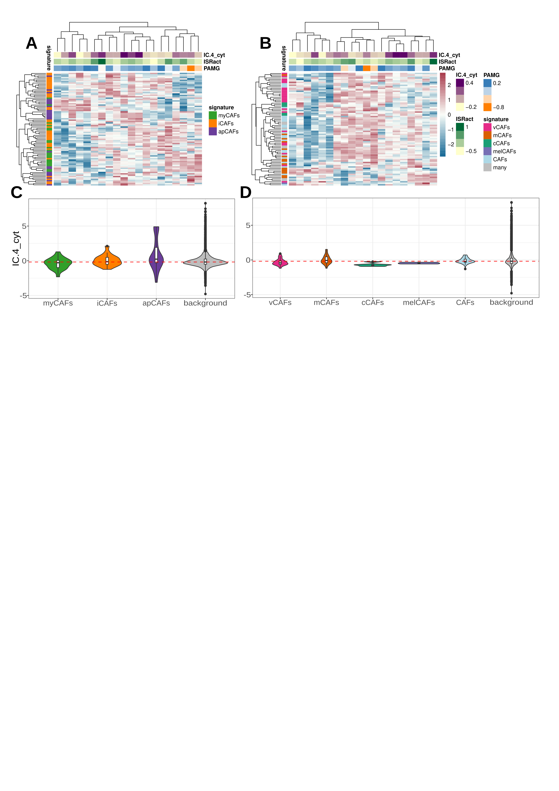

<h4 align="left">

**FigR16:** CAFs show different enrichment scores depending on whether total, efficiently translated mRNA levels, or Translation Efficacies are utilised (pg 117)

</h4>

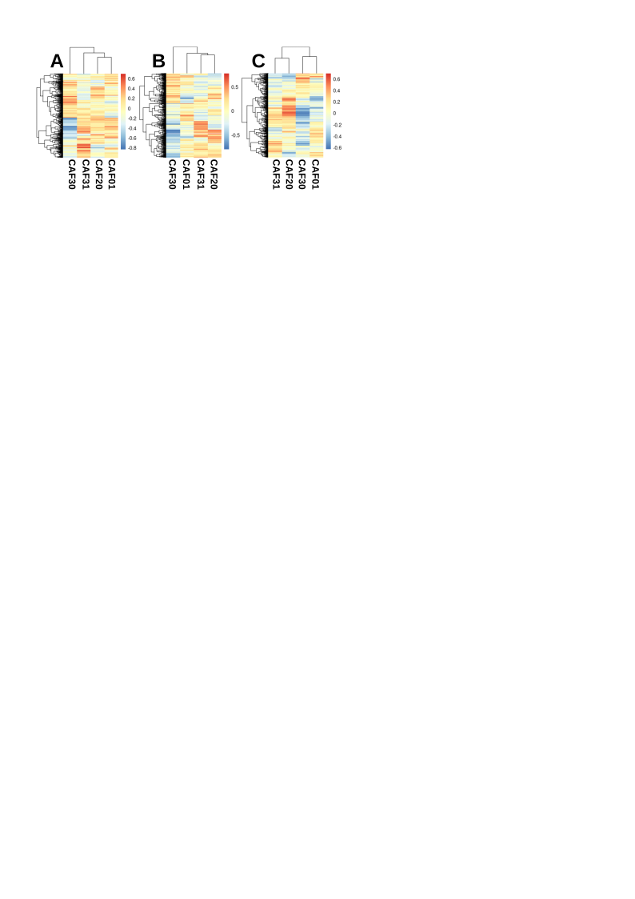

<h4 align="left">

**FigR17:** Stimulated CAF data is under a strong batch effect and individual stimuli analysis suggests a problem in the experiment rendering the data inadequate for analysis (pg 120)

</h4>

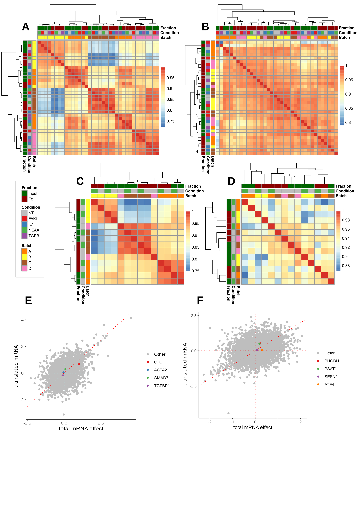

