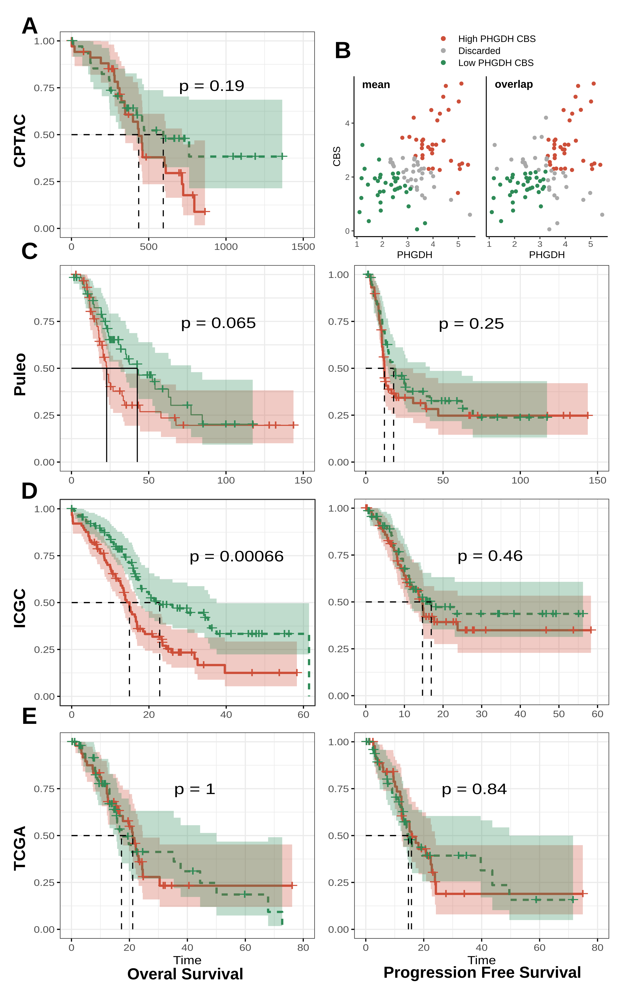
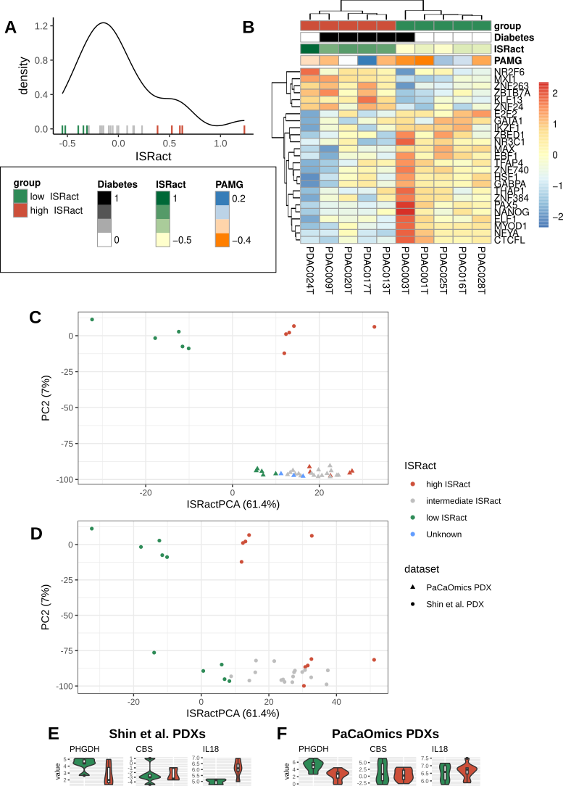
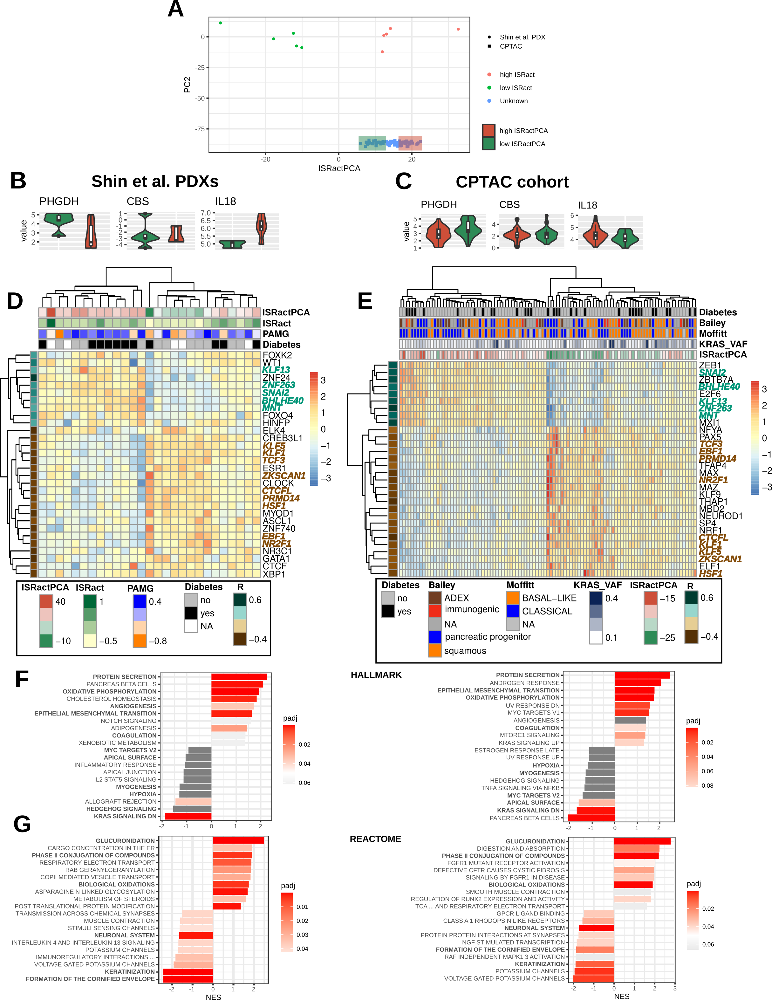
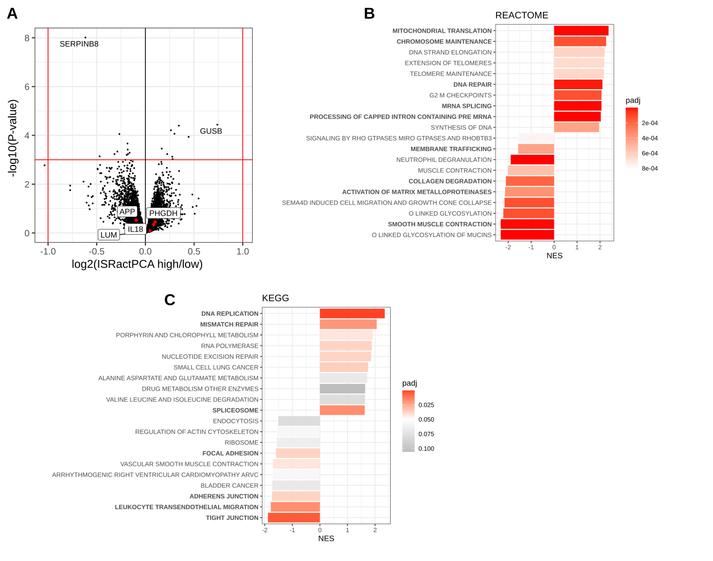
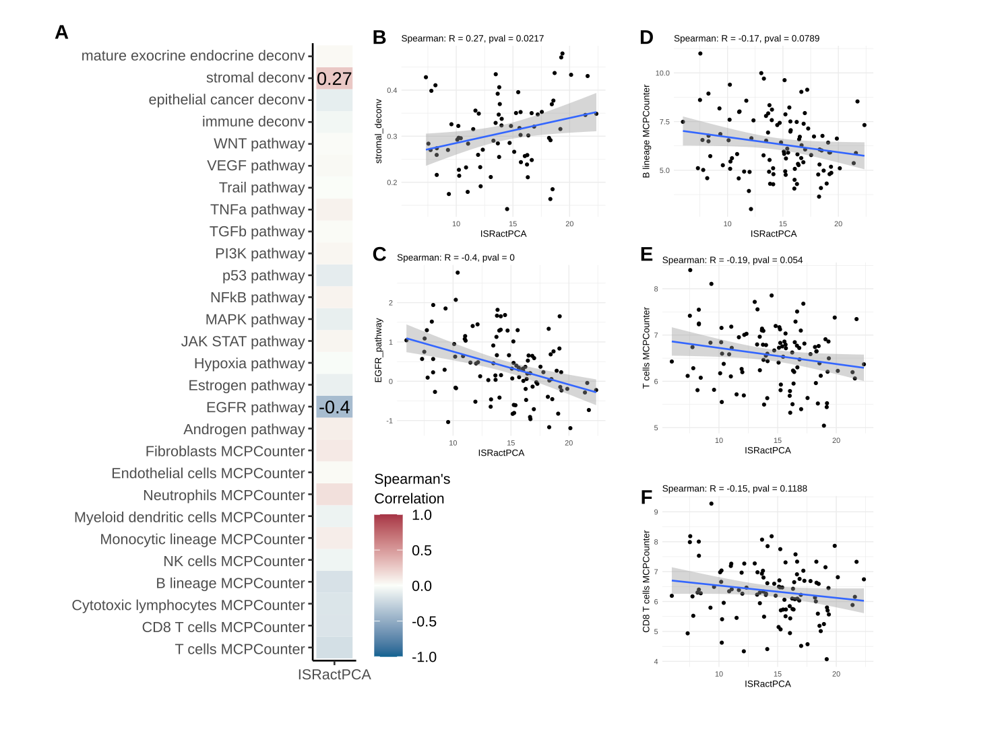
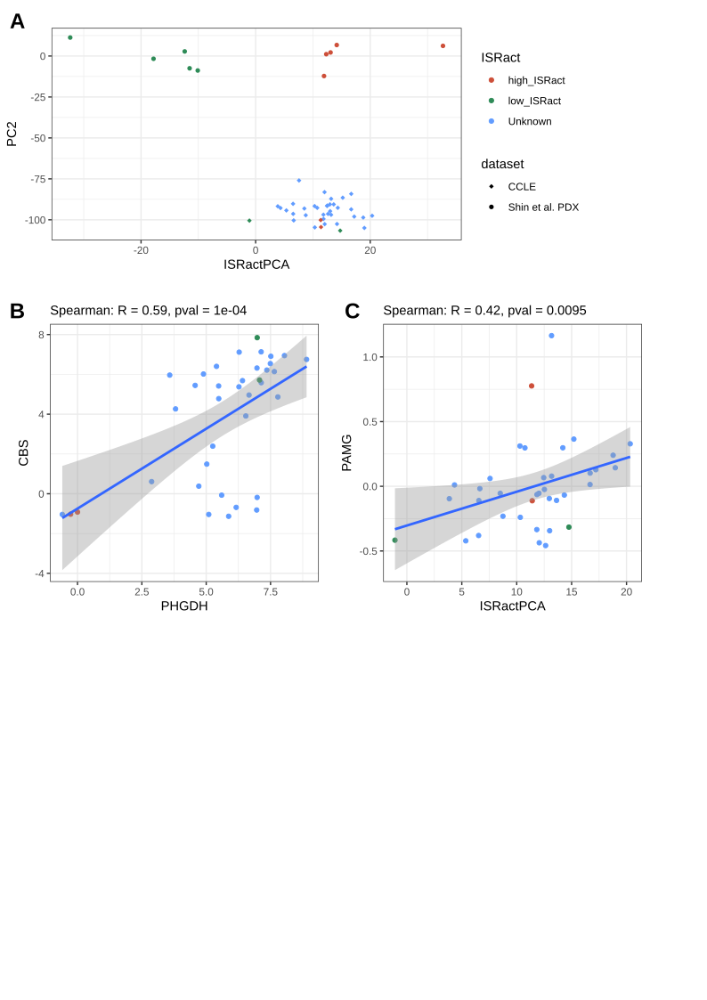
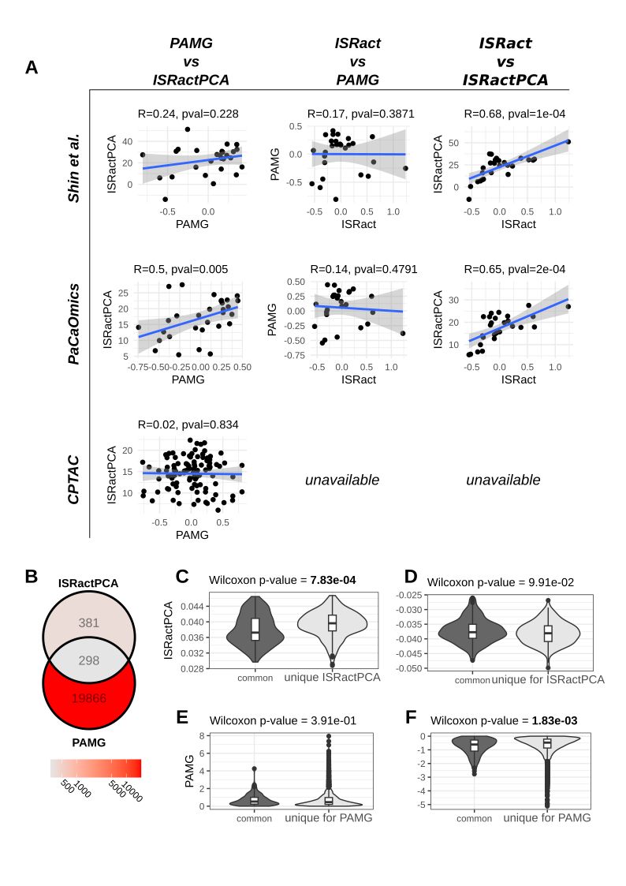
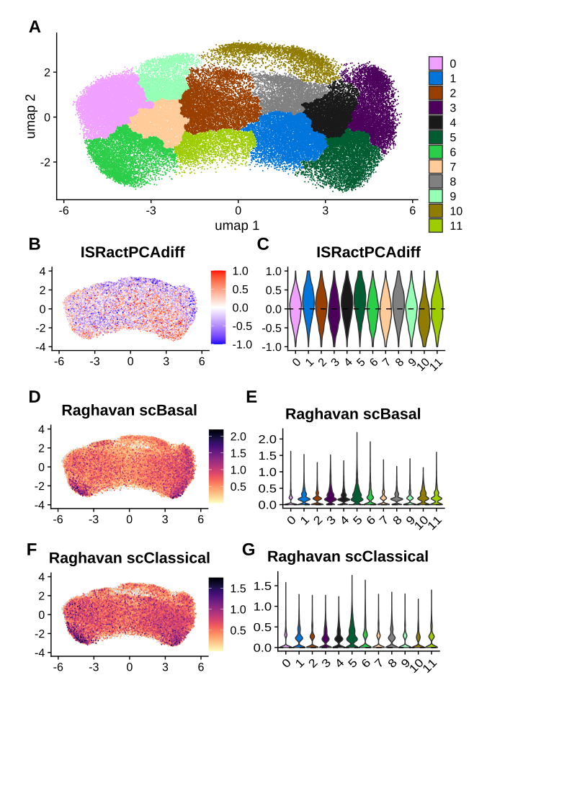
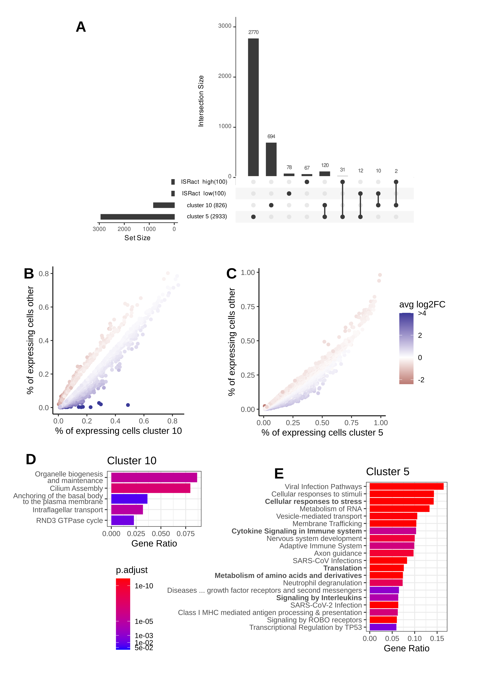
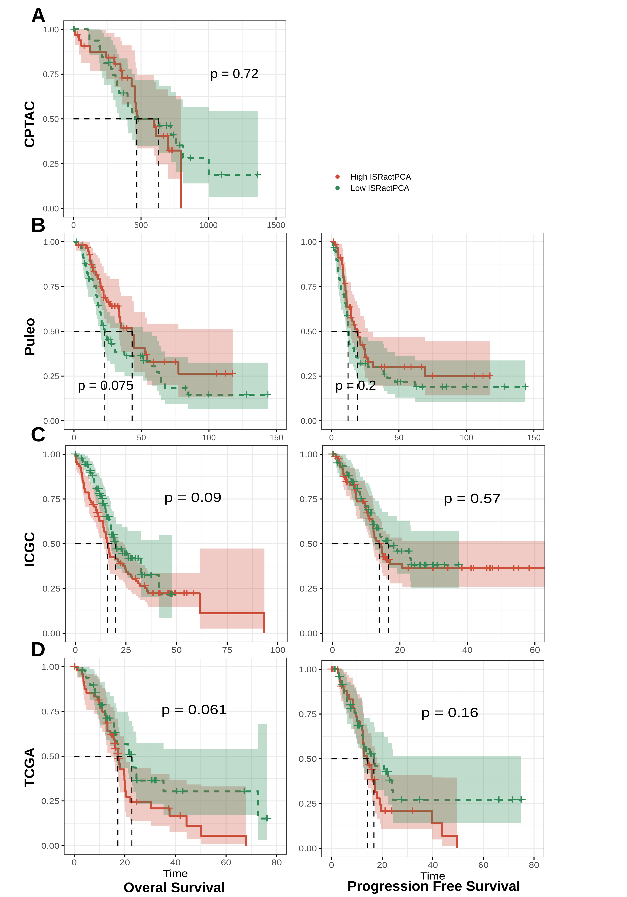

<!-- PROJECT LOGO -->

<h1 align="center">

# TRANSDUCER - Detection of ISRact in human

</h1>

<h2 align="left">

## Summary

</h2>

Along this Document a quick summary is provided with references to the figures. In each of the parts of this summary a list of the scripts that produce the named figures. Afterwards, if any modification has happened, or tried, it will be specified here. Later on, the figures are also provided for visualization

<!-- Content -->

<h2 align="left">

## Initial Exploration using python (**ABSENT IN MANUSCRIPT**)

</h2>

This Section of the repository covers the analysis performed on the PDX tumour to obtain a transcriptomic version of ISRact. In an initial exploration for assessing the nature of the classification problem different dimensionality reductions and data configurations were tested. This resulted for the first time in a first component of a PCA representing ISRact in transcription. Here, also a nearest shrunken classifier was evaluated. The first step in this also included the production of scatterplots for marker genes and TF activity.

Code:

 * [03_IC3Characterization/01_PDX/090721_IC3_Predictive_Model/Model_creation.ipynb](https://github.com/VeraPancaldiLab/TRANSDUCER/blob/main/03_IC3Characterization/01_PDX/090721_IC3_Predictive_Model/Model_creation.ipynb)
 * Processing and other data manipulations -> [03_IC3Characterization/01_PDX](https://github.com/VeraPancaldiLab/TRANSDUCER/tree/main/03_IC3Characterization/01_PDX)

################################################################################

<h2 align="left">

## Creation of ISRactPCA

</h2>

With the help of Enzo Faucher, this component was optimised and produced based on Shin et al. cohort, and tested with the full cohort or in PACAOMICs. This involved normalisation number of genes and correlation (**FigR19**). The code was cleaned and summarized inside the respective scripts. Enzo's full internship code can also be found in this repository.

Code:

 * https://github.com/VeraPancaldiLab/TRANSDUCER/blob/main/06_ISRact_Projection/ISRactPCA.R
 * https://github.com/VeraPancaldiLab/TRANSDUCER/blob/main/06_ISRact_Projection/PACAOMICS_proj.R
 * Enzo's code -> https://github.com/VeraPancaldiLab/TRANSDUCER/tree/main/06_Enzos_Internship/human_cohort_analysis

################################################################################

<h2 align="left">

## Testing ISRactPCA

</h2>

In order to explore the similarity in ISRactPCA, high and low samples used for training and the corresponding 33% top and bottom ISRactPCA samples were compared using DGEA, Enrichment analysis and marker gene expression. Aditionally TF activity was computed and compared using Viper. This was done on Shin et al. PDX data, and the CPTAC cohort for the thesis mansucript (**FigR20**). For CPTAC the proteome was also analysed to explore changes at the protein level related to ISRactPCA (**FigR21**). Comparison with precumputed cell type estimations was also performed, with surprising results (**FigR22**)

In addition, this was also carried out on the PaCaOmics samples and in Maurer cohort, taking advantage of the separation of Epithelial enriched fractions and stroma (**ABSENT IN MANUSCRIPT**).

Code:

 * [06_ISRact_Projection/ISRactPCA.R](https://github.com/VeraPancaldiLab/TRANSDUCER/blob/main/06_ISRact_Projection/ISRactPCA.R)

 * [06_ISRact_Projection/ISRactPCA_testgenes.R](https://github.com/VeraPancaldiLab/TRANSDUCER/blob/main/06_ISRact_Projection/ISRactPCA_testgenes.R)

 * [06_ISRact_Projection/CPTAC_proj.R](https://github.com/VeraPancaldiLab/TRANSDUCER/blob/main/06_ISRact_Projection/CPTAC_proj.R)

 * [06_ISRact_Projection/CPTAC_proj_testgenes.R](https://github.com/VeraPancaldiLab/TRANSDUCER/blob/main/06_ISRact_Projection/CPTAC_proj_testgenes.R)

 * [06_ISRact_Projection/PACAOMICS_proj.R](https://github.com/VeraPancaldiLab/TRANSDUCER/blob/main/06_ISRact_Projection/PACAOMICS_proj.R)

 * [06_ISRact_Projection/Maurer_proj.R](https://github.com/VeraPancaldiLab/TRANSDUCER/blob/main/06_ISRact_Projection/Maurer_proj.R)

 * [06_ISRact_Projection/Maurer_proj_testgenesj.R](https://github.com/VeraPancaldiLab/TRANSDUCER/blob/main/06_ISRact_Projection/Maurer_proj_testgenesj.R)

 * Enzo's code -> [06_Enzos_Internship/human_cohort_analysis](https://github.com/VeraPancaldiLab/TRANSDUCER/tree/main/06_Enzos_Internship/human_cohort_analysis)

################################################################################

<h2 align="left">

## in vitro ISRactPCA projection

</h2>

For the exploration of in vitro cell lines, hoping to match those used to characterise ISRact on the wet lab, RNAseq data from Broad Institute Cancer Cell Line Encyclopedia (CCLE) was projected onto ISRactPCA (**FigR23**). We did this filtering for PDAC originated cell lines, and obtained inconsistent results with the in vitro characterization. Comparison between ISRactPCAa and PAMG showed traits of capturing either the baseline tumour characteristics, inherent or not to ISRactPCA classification.

Code:

 * [06_ISRact_Projection/CCLE_proj.R](https://github.com/VeraPancaldiLab/TRANSDUCER/blob/main/06_ISRact_Projection/CCLE_proj.R)

################################################################################

<h2 align="left">

## Assesment of relation with PAMG subtype (Basal/Classical)

</h2>

For exploring more indepth the relation of ISRactPCA with Basal/Classical all the cohorts were assessed for both scores, which were then compared by correlation. ISRact score was included when possible. This was also done but not shown in TCGA, ICGC, Puleo and Maurer. Additionally, an indepth comparison between ISRactPCA and PAMGs gene weighs showed that even though ISRactPCA is capturing traces of the Basal/Classical phenotype, different trends are being captured, especially on ISRactPCA high scored samples (**FigR24**).

Code:

 * Gene weight comparison and Shin et al. -> [06_ISRact_Projection/ISRactPCA.R](https://github.com/VeraPancaldiLab/TRANSDUCER/blob/main/06_ISRact_Projection/ISRactPCA.R)
 * [06_ISRact_Projection/PACAOMICS_proj.R](https://github.com/VeraPancaldiLab/TRANSDUCER/blob/main/06_ISRact_Projection/PACAOMICS_proj.R)
 * [06_ISRact_Projection/CPTAC_proj_testgenes.R](https://github.com/VeraPancaldiLab/TRANSDUCER/blob/main/06_ISRact_Projection/CPTAC_proj_testgenes.R)

################################################################################
<h2 align="left">

## single cell ISRact signature

</h2>

In order to explore further this subtype and try to define it at the scRNAseq level we made use of AUCell combined with a standard analysis of cluster definition on the tumoural population (**FigR25**). In this analysis 2 possible visualisations were explored, a first one as provided in the manuscript (10 clusters, Cluster 5 as ISRactlow and Cluster 10 as ISRacthigh) and an alternative one aiming at splitting the cells in only two groups, one for each sub population. In both cases the analysis detected such populations showed a similar enrichment of their gene contributions (**FigR26**).

Additionally we assessed the connection of ISRactPCAdiff score (difference of ISRacthigh and ISRactlow AUC scores) with response to treatment and chemotherapy regimen given, as well as some improved Basal/Classical/Intermediate signatures. This analysis revealed a potential connection of ISRAct with the BRCANess of the tumour. (**ABSENT IN MANUSCRIPT**)

We also tried the approach of Marquez Galera et al. 2020, although it was not tested to the point of defining signatures due to limited computational power. (**ABSENT IN MANUSCRIPT**)

Code:

 * [06_ISRact_Projection/Hwang_AUCell_onlytumor.Rmd](https://github.com/VeraPancaldiLab/TRANSDUCER/blob/main/06_ISRact_Projection/Hwang_AUCell_onlytumor.Rmd)
* [06_ISRact_Projection/Hwang_STARMarquezGalera_scProj.R](https://github.com/VeraPancaldiLab/TRANSDUCER/blob/main/06_ISRact_Projection/Hwang_STARMarquezGalera_scProj.R)

################################################################################

<h2 align="left">

## Analysis of survival

</h2>

To explore the survival related to ISRact in bulk RNAseq cohorts (CPTAC, Puleo, TCGA, ICGC) we first used the levels of wet lab defined markers (PHGDH/CBS) (FigR18). Then in the same scripts we projected each dataset to the ISRactPCA space and evaluated  thir fitting as well as explored their impact on survival by splitting and doing a log rank test in ISRActPCA high vs low (**FigR27**). We also tried to fit cox regression models when assumptions were fulfilled. (**ABSENT IN MANUSCRIPT**)

Given the connection observed in Hwang et al. 2022 with the BRCAness status of the patient we assessed the connection of DNA repair mutated genes with ISRActPCA in TCGA. (**ABSENT IN MANUSCRIPT**)

Code:

* [06_ISRact_Projection/CPTAC_proj.R](https://github.com/VeraPancaldiLab/TRANSDUCER/blob/main/06_ISRact_Projection/CPTAC_proj.R)
* [06_ISRact_Projection/ICGC_proj.R](https://github.com/VeraPancaldiLab/TRANSDUCER/blob/main/06_ISRact_Projection/ICGC_proj.R)
* [06_ISRact_Projection/Puleo_Proj.R](https://github.com/VeraPancaldiLab/TRANSDUCER/blob/main/06_ISRact_Projection/Puleo_Proj.R)
* [06_ISRact_Projection/TCGA_proj.R](https://github.com/VeraPancaldiLab/TRANSDUCER/blob/main/06_ISRact_Projection/TCGA_proj.R)

################################################################################

<h2 align="left">

## ISRactICA (**ABSENT IN MANUSCRIPT**)

</h2>

Given the relationship seen of ISRactPCA with Basal Classical, we tried to develop an ICA based classifier, which we termed ISRactICA. For this I applied the ICA based approach I developed in the Molecular Signature Generator, where ICA is applied iteratively with different number of components to find the best match to ISRact, in the transcriptome. Then by doing the same in PACAOMICS, now trying to match the source signal of the ISRactICA. This showed similar trends of TF activities, enrichment terms, and relation with PAMG, but not so much with BRCAness. 

Code:

* Generation of ISRactICA using [The Molecular Signature Generator](https://github.com/j-solor/The-Molecular-Signature-Generator?tab=readme-ov-file) -> [06_Human_Cohort_Projection/01_PDXTranslation_to_PDXTrascription/ISR_act_first.R](https://github.com/VeraPancaldiLab/TRANSDUCER/blob/main/06_Human_Cohort_Projection/01_PDXTranslation_to_PDXTrascription/ISR_act_first.R)

* [06_ISRact_Projection/ISRactPCA_testgenes.R](https://github.com/VeraPancaldiLab/TRANSDUCER/blob/main/06_ISRact_Projection/ISRactPCA_testgenes.R)

* [06_ISRact_Projection/PACAOMICS_proj.R](https://github.com/VeraPancaldiLab/TRANSDUCER/blob/main/06_ISRact_Projection/PACAOMICS_proj.R)

################################################################################

<h3 align="left">

**FigR18:** Survival analysis reveals inconsistencies for detecting a relation between ISRact and survival based on PHGDH/CBS average expression (pg 126)

</h3>

<h3 align="left">

**FigR19:** PCA allows the separation of ISRact high and low PDX samples based on transcriptomics (pg 130)

</h3>

<h3 align="left">

**FigR20:** ISRactPCA captures signals consistently in Shin et al. PDX and CPTAC cohort, recapitulating signals related to gemcitabine resistance (pg 134)

</h3>

<h3 align="left">

**FigR21:** ISRactPCA high vs low samples proteomic comparison does not show differential expressed proteins, while supporting glucuronidation involvement (pg 137)

</h3>

<h3 align="left">

**FigR22:** ISRactPCA shows a negative correlation with Lymphocyte estimated proportions in the CPTAC human cohort (pg 138)

</h3>

<h3 align="left">

**FigR23:** CCLE cell line data projection onto ISRactPCA is not consistent with the in-vitro defined markers (pg 141)

</h3>

<h3 align="left">

**FigR24:** ISRactPCA could capture characteristics related to Basal/Classical classification (pg 145)

</h3>

<h3 align="left">

**FigR25:** Analysis of ISRactPCA on snRNAseq reveals two clusters corresponding to the ISRactPCA_high and ISRactPCA_low phenotypes (pg 146)

</h3>

<h3 align="left">

**FigR26:** Cluster 5 and 10 marker genes have a substantial overlap with ISRactPCA genes and show enrichment in relevant terms such as innate immunity or ISR activation (pg 148)

</h3>

<h3 align="left">

**FigR27:** ISRactPCA score is not predictive of survival across the major PDAC cohorts (pg 150)

</h3>

